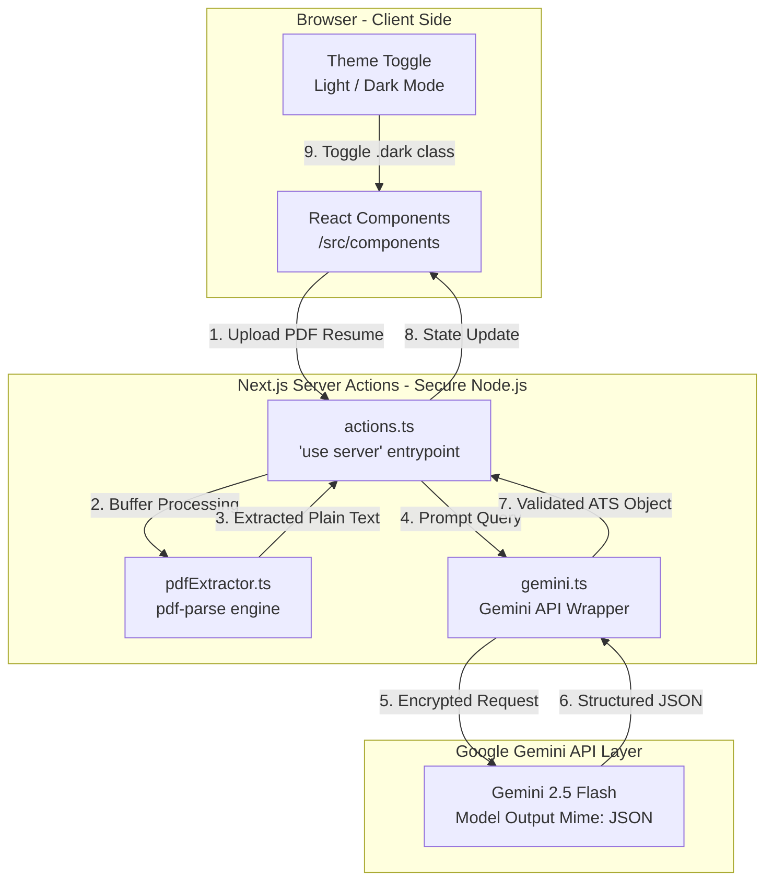
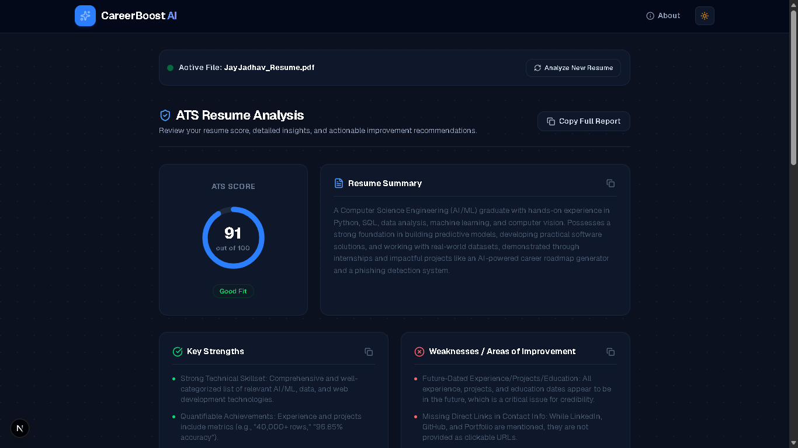

# CareerBoost AI 🚀

CareerBoost AI is a complete, production-ready, AI-powered Resume Analyzer and Interview Preparation Coach built using **Next.js App Router**, **TypeScript**, **Tailwind CSS**, and the **Google Gemini AI API**.

Job seekers upload their PDF resume to instantly receive an ATS compliance score, resume formatting suggestions, strengths, weaknesses, and a custom deck of 25 interview questions (Technical, HR, and Project-based) complete with suggested reference answers customized specifically to the experiences listed on their resume.

---

## 🏗️ System Architecture

This application is built as a single-session web app, keeping all candidate data secure and private by processing resume contents strictly in-memory without a database.



---

## 🔄 Core Application Workflow

1. **Upload & Parser (In-Memory)**: The candidate uploads a resume PDF. The React upload component converts the file into a Node buffer and executes text extraction using `pdf-parse` strictly on the server.
2. **ATS Scoring Rubric**: The plain text is fed to `gemini-2.5-flash` with a temperature setting of `0` to guarantee deterministic and stable scores. The prompt calculates a score out of 100 based on standard formatting and key credentials.
3. **Reference Q&As**: Generates 10 Technical, 10 Behavioral, and 5 Project questions, including a 1-to-2 sentence answer guide showing the user how to talk about their achievements.
4. **Interactive Accordion UI**: Renders results in a responsive tabbed view where candidate questions feature toggleable accordion panels to reveal reference answer guides.

---

## 📷 Screenshots & Visual Demo


### 1. Landing Page & Upload Dropzone

> This landing screen invites job seekers to upload their resume using a drag-and-drop file uploader. 
> The UI features an animated radial grid backdrop and a sleek light/dark mode header selector.

### 2. ATS Analysis Dashboard

> Displays the calculated ATS score inside a custom-styled circular progress gauge with rating indicators. 
> Features detailed cards for professional summaries, key strengths, formatting weaknesses, missing skills, and suggestions.

### 3. Interview Preparation Q&As

> Renders Technical, HR, and Project interview questions in a clean tabbed panel. 
> Each card can be clicked to slide open a "Reference Answer Guide" displaying custom, resume-specific guidance.

### 4. Adaptive Dark Mode View

> Shows the entire SaaS interface adapted to a premium dark theme using HSL slate variables. 
> Provides high-contrast readability and glowing ambient blur blobs for a premium user experience.

---

## 🚀 Local Development Setup

To run CareerBoost AI locally on your machine, follow these steps:

1. **Clone the Directory & Install**:
   ```bash
   cd careerboost-ai
   npm install
   ```

2. **Configure Environment variables**:
   ```bash
   cp .env.local.example .env.local
   ```
   Open `.env.local` and replace `your_gemini_api_key_here` with your API key from [Google AI Studio](https://aistudio.google.com/).

3. **Start Local Server**:
   ```bash
   npm run dev
   ```
   Open [http://localhost:3000](http://localhost:3000) in your browser.

---

## 📦 Deploying to Vercel

1. Push your repository to **GitHub**.
2. Connect your GitHub account to **Vercel** and import this project.
3. Add the following **Environment Variable** in the Vercel project configuration page:
   - **Key**: `GEMINI_API_KEY`
   - **Value**: `YOUR_AI_STUDIO_API_KEY_HERE`
4. Click **Deploy**. Vercel will host your site on its secure, global serverless framework.

---

## 👨‍💻 Developer Profile

**Jay Jadhav**
- **Email**: [jaydjadhav1111@gmail.com](mailto:jaydjadhav1111@gmail.com)

- **LinkedIn**: [in/jayjadhav04](https://linkedin.com/in/jayjadhav04)
- **GitHub**: [github.com/jayjadhav04](https://github.com/jayjadhav04)
- **Portfolio**: [jay-jadhav-portfolio.vercel.app](https://jay-jadhav-portfolio.vercel.app)
